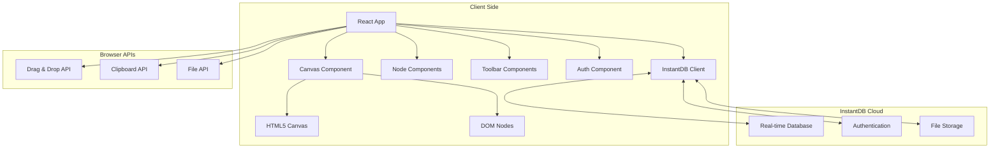
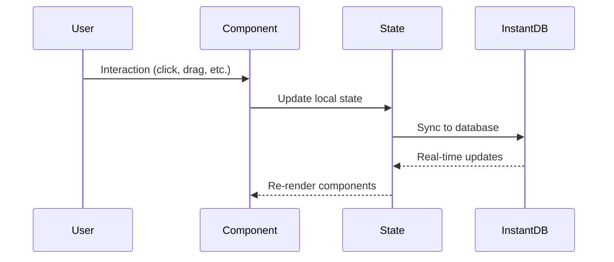
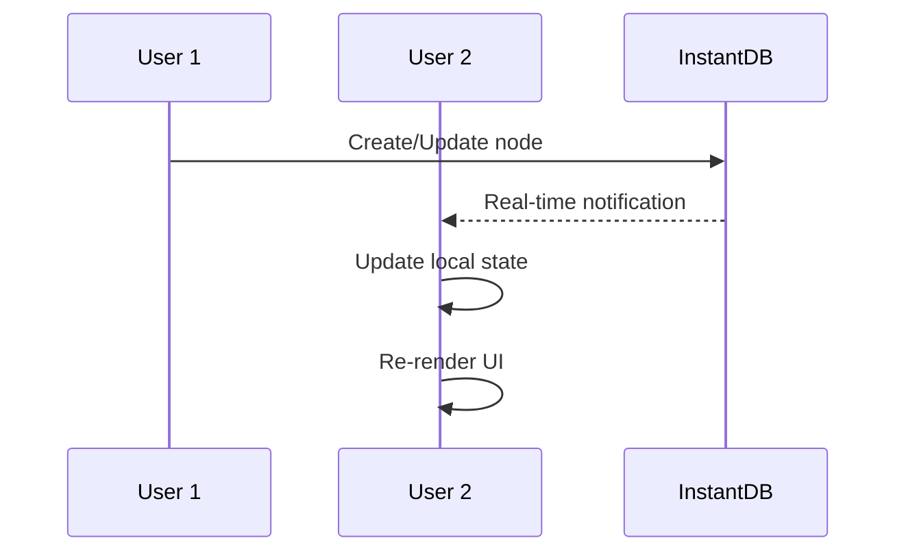
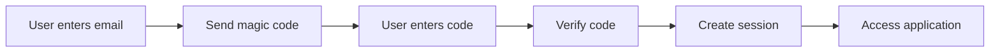

# Technical Architecture

## 🏗️ System Overview

The Mind Map Application is built as a modern web application with real-time collaboration capabilities. The architecture follows a client-server model with InstantDB handling data persistence and real-time synchronization.



## 🔧 Technology Stack

### Frontend
- **React 18** - UI framework with hooks and functional components
- **TypeScript** - Type safety and developer experience
- **Vite** - Fast build tool and development server
- **Tailwind CSS** - Utility-first CSS framework
- **HTML5 Canvas** - For drawing connections and grid
- **Lucide React** - Icon library

### Backend & Database
- **InstantDB** - Real-time database with built-in collaboration
- **Magic Link Authentication** - Passwordless authentication system

### Development Tools
- **ESLint** - Code linting and formatting
- **PostCSS** - CSS processing
- **React Hot Toast** - Notification system

## 📁 Project Structure

```
src/
├── components/              # React components
│   ├── Canvas.tsx          # Main canvas with zoom/pan
│   ├── Node.tsx            # Individual node component
│   ├── Auth.tsx            # Authentication flow
│   ├── UnifiedToolbar.tsx  # Main toolbar
│   ├── MiniToolbar.tsx     # Selection toolbar
│   ├── ContextMenu.tsx     # Right-click menus
│   ├── Group.tsx           # Node grouping
│   ├── GroupToolbar.tsx    # Group management
│   └── HelpPanel.tsx       # Keyboard shortcuts help
├── hooks/                  # Custom React hooks
│   ├── useKeyboardShortcuts.ts
│   └── useDragAndDrop.ts
├── types/                  # TypeScript definitions
│   └── index.ts
├── utils/                  # Utility functions
│   ├── canvas.ts           # Canvas math utilities
│   ├── geometry.ts         # Geometric calculations
│   └── storage.ts          # Local storage helpers
├── lib/                    # External configurations
│   └── db.ts              # InstantDB setup
├── App.tsx                 # Main application
└── main.tsx               # Application entry point
```

## 🎯 Core Components

### Canvas System
```typescript
// Canvas coordinates transformation
screenToCanvas(screenPos: Point, canvas: CanvasState): Point
canvasToScreen(canvasPos: Point, canvas: CanvasState): Point

// Zoom and pan management
clampZoom(scale: number): number
getGridSpacing(scale: number): number
```

### Node Management
```typescript
interface NodeData {
  id: string;
  type: 'text' | 'image' | 'link';
  content: string;
  position: Point;
  size: { width: number; height: number };
  parentId?: string;
  children: string[];
  selected: boolean;
  editing: boolean;
  groupId?: string;
  style: NodeStyle;
}
```

### State Management
```typescript
interface AppState {
  nodes: Record<string, NodeData>;
  groups: Record<string, GroupData>;
  canvas: CanvasState;
  activeNodeId: string | null;
  theme: 'light' | 'dark';
  contextMenu: ContextMenuState | null;
}
```

## 🔄 Data Flow

### 1. User Interaction


### 2. Real-time Collaboration


## 🎨 Rendering Strategy

### Hybrid Rendering Approach
- **DOM Elements** - For interactive nodes (better event handling)
- **HTML5 Canvas** - For connections and grid (better performance)

### Canvas Rendering Pipeline
1. **Clear Canvas** - Remove previous frame
2. **Draw Grid** - Dot grid based on zoom level
3. **Draw Connections** - Bezier curves between nodes
4. **Draw Arrows** - Optional connection arrows

### Node Rendering
- **React Components** - Each node is a React component
- **Absolute Positioning** - CSS transforms for positioning
- **Event Handling** - Mouse/touch events for interaction

## 🔐 Authentication & Security

### Authentication Flow


### Data Security
- **Row Level Security** - InstantDB permissions
- **User Isolation** - Data scoped to authenticated users
- **Real-time Validation** - Client and server-side validation

## 📊 Performance Considerations

### Optimization Strategies
- **Virtual Scrolling** - For large node collections
- **Canvas Optimization** - Efficient redraw cycles
- **Debounced Updates** - Reduce database writes
- **Memory Management** - Cleanup event listeners

### Scalability Limits
- **Current**: ~1000 nodes per mind map
- **Target**: 10,000+ nodes with virtualization
- **Concurrent Users**: 100+ per mind map

## 🔧 Development Workflow

### Local Development
```bash
npm run dev          # Start development server
npm run build        # Build for production
npm run lint         # Run linting
npm run preview      # Preview production build
```

### Code Quality
- **TypeScript** - Strict type checking
- **ESLint** - Code style enforcement
- **React Hooks Rules** - Hooks usage validation

### Testing Strategy (Future)
- **Unit Tests** - Component and utility testing
- **Integration Tests** - User flow testing
- **E2E Tests** - Full application testing

## 🚀 Deployment

### Build Process
1. **TypeScript Compilation** - Type checking and JS generation
2. **Asset Optimization** - CSS/JS minification
3. **Bundle Analysis** - Size optimization
4. **Static Generation** - HTML/CSS/JS files

### Hosting Requirements
- **Static Hosting** - CDN-friendly SPA
- **HTTPS Required** - For clipboard and file APIs
- **Modern Browsers** - ES2020+ support

## 🔮 Future Architecture Considerations

### Scalability Improvements
- **Web Workers** - Background processing
- **IndexedDB** - Client-side caching
- **Service Workers** - Offline support
- **WebAssembly** - Performance-critical operations

### Advanced Features
- **WebRTC** - Peer-to-peer collaboration
- **WebGL** - 3D visualizations
- **Web Components** - Reusable UI elements
- **Micro-frontends** - Modular architecture